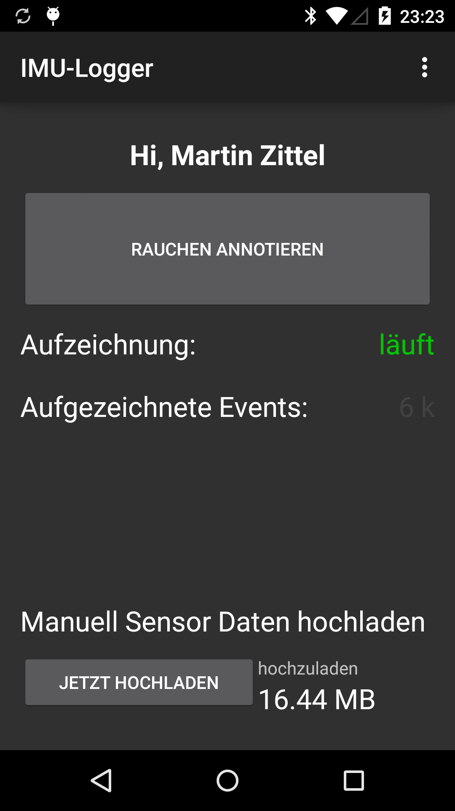
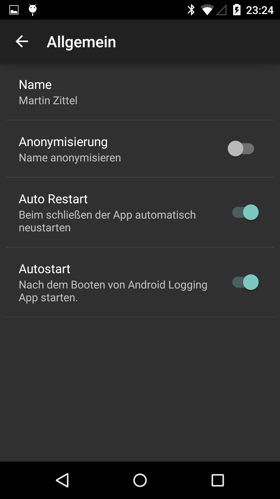
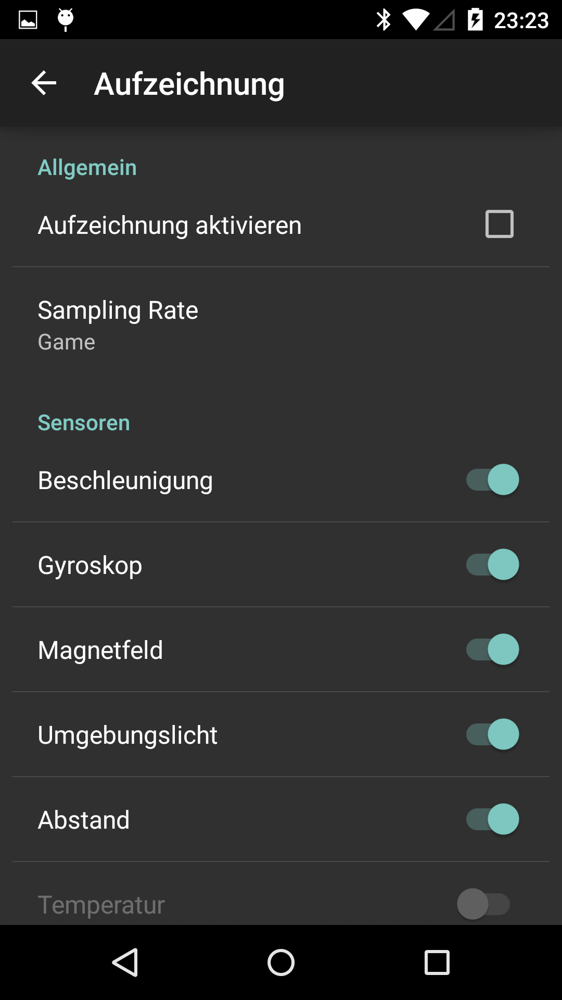
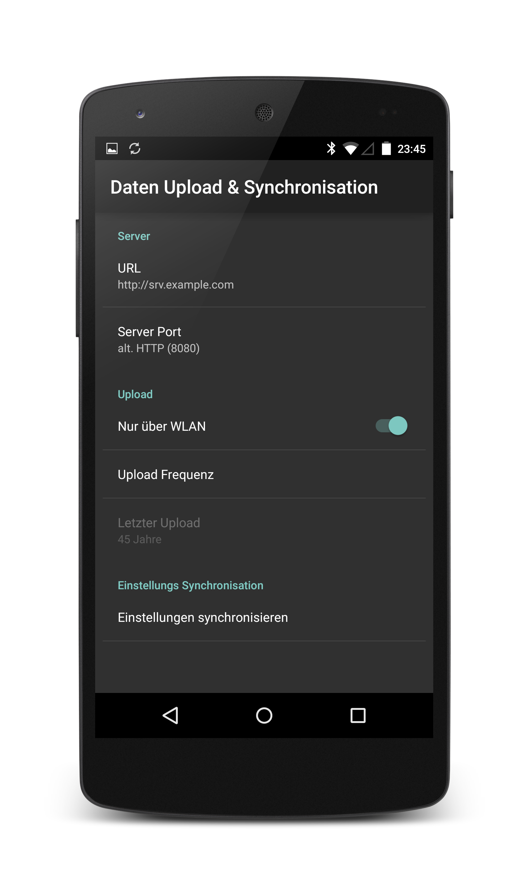
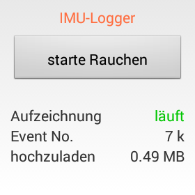

# Welcome to the Android Sensor Logger Docs

The Android Sensor Logger is a Tool to log data for Activity Recognition Studys.

Therefore the Android Sensor Logger can:  

* log the built-in Android (Wear) Sensors
* save Annotations from the [iLitit](https://github.com/pscholl/iLitIt_Android) Smart-Lighter
* log Bluetooth RSSI Values
* **log some Bluetooth Gas Sensors** 

This App was developed for a smoking recognition study (That's why the, configurable, Annotation Buttons talk about smoking).

## Deployment

### The [0.4 Alpha APK ](imu-logger.apk)

Further [Deployment](deploy) Information.

## Smartphone App UI

{: style="max-width: 200px"}
{: style="max-width: 200px"}
{: style="max-width: 200px"}
{: style="max-width: 200px"}

## Smartwatch UI

{: style="max-width: 200px"}
{: style="max-width: 200px"}