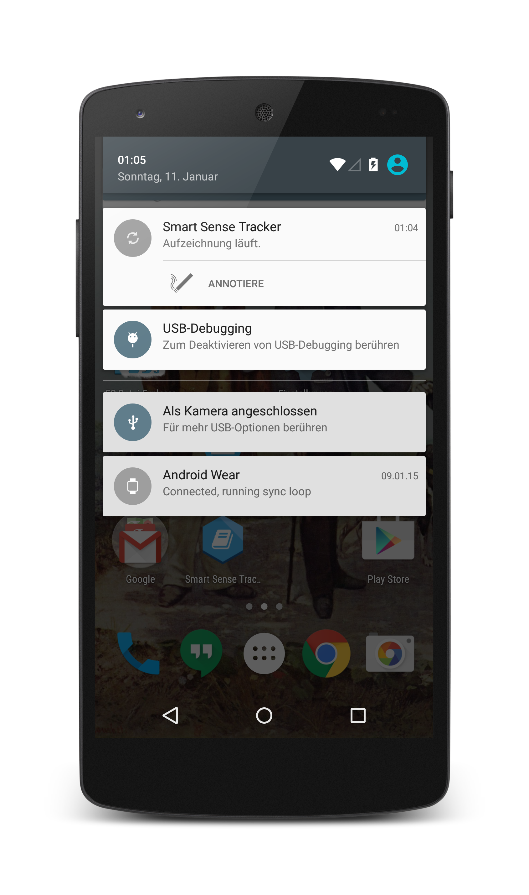

# Welcome to the Smart Sense Tracker Docs

The Smart Sense Tracker is a Tool to log data for Activity Recognition Studys.

Therefore the Smart Sense Tracker can:  

* log the built-in Android (Wear) Sensors
* save Annotations from the [iLitit](https://github.com/pscholl/iLitIt_Android) Smart-Lighter
* log Bluetooth RSSI Values
* **log some Bluetooth Gas Sensors** 

This App was developed for a smoking recognition study (That's why the, configurable, Annotation Buttons talk about smoking).

## Deployment

### Directly download the [0.13 Alpha APK ](smart_sense_tracker.apk)

### Get it from the [Google Play Store](https://play.google.com/store/apps/details?id=ess.imu_logger)

Further [Deployment](deploy) Information.

## Smartphone App UI

{: style="max-width: 200px"}
{: style="max-width: 200px"}
{: style="max-width: 200px"}
{: style="max-width: 200px"}
{: style="max-width: 200px"}

## Smartwatch UI

{: style="max-width: 200px"}
{: style="max-width: 200px"}
{: style="max-width: 200px"}
{: style="max-width: 200px"}
{: style="max-width: 200px"}